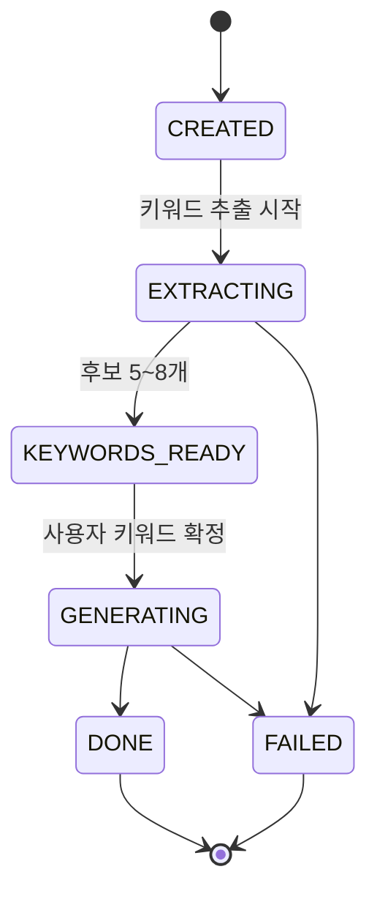

# GO. (고점) — ERD / 데이터베이스 설계서

| 항목 | 내용 |
| --- | --- |
| 문서 버전 | v2.0 |
| 최종 수정일 | 2026-08-13 |
| 상위 문서 | [PRD.md](PRD.md) · [design.md](design.md) |
| 짝 문서 | [API.md](API.md) — 컬럼과 API 필드는 1:1 대응 |
| DBMS | PostgreSQL 16 |
| 마이그레이션 | Flyway (`backend/src/main/resources/db/migration/`) |
| ORM | Spring Data JPA · Hibernate 6 |

> **v2 변경 요약** — Figma 시안 대조 결과 반영.
> ① 우선순위가 `analyses`에서 **`profiles`로 이동**하고 단일값 → **순서 있는 3개 배열**이 됨
> ② 카테고리 Enum이 4종 → **3종**(FACE 제거)
> ③ 인바디 3종 → **6종**
> ④ 참고 이미지 단수 → **다중**
> ⑤ `input_mode` 제거, `input_text` 500자
> ⑥ `top_changes` 구조 변경 (rank/tag → category)
> ⑦ `change_intensity` 정수 → 텍스트
> ⑧ `routine_tasks`에 타이밍·분량 필드 추가
> ⑨ `ai_jobs`에 `INBODY_OCR` 단계 추가
>
> **v2.1** — 목표 생성 경로가 2종(저장된 분석 결과 기반 / 새 루틴)임이 확정되어 `routines`에 `source_type`·`category`·`duration_weeks`·`end_date`를 복원했다.

---

## 1. 설계 규칙

| # | 규칙 |
| --- | --- |
| D-1 | 테이블·컬럼은 `snake_case`, API JSON은 `camelCase`. |
| D-2 | 모든 PK는 `UUID` (`gen_random_uuid()`). 순차 ID 노출 차단. |
| D-3 | `created_at` / `updated_at`은 `TIMESTAMPTZ`, **UTC 저장 / KST 표시**. |
| D-4 | **이미지 원본은 DB에 저장하지 않는다.** 스토리지 key만 저장하고 조회 시 presigned URL 발급. |
| D-5 | 사용자 삭제는 soft delete 후 배치 하드 삭제. **사진 객체는 즉시 삭제**. |
| D-6 | AI 출력 중 조회·필터 대상은 컬럼, 표시 전용은 JSONB. |
| D-7 | Enum은 `VARCHAR` + `CHECK` 제약. PG enum 타입은 쓰지 않는다. |
| D-8 | 금액은 `INTEGER`(원), 비율은 `NUMERIC`. |

---

## 2. ERD

```mermaid
erDiagram
    users ||--o{ consents : "동의"
    users ||--o{ profiles : "프로필 이력"
    users ||--o{ analyses : "고점 분석"
    users ||--o{ saved_results : "서랍"
    users ||--o{ routines : "목표"
    users ||--|| notification_settings : "알림 설정"
    users ||--o{ device_tokens : "기기"
    users ||--o{ subscriptions : "구독"

    profiles ||--o{ analyses : "기준 프로필"
    analyses ||--o{ analysis_reference_images : "참고 사진"
    analyses ||--o{ analysis_keywords : "키워드 후보"
    analyses ||--|| analysis_results : "결과"
    analyses ||--o{ ai_jobs : "AI 호출"
    analysis_results ||--o| saved_results : "저장"
    analysis_results ||--o{ routines : "근거 결과"
    routines ||--o{ routine_tasks : "태스크"
    subscriptions ||--o{ payments : "결제"

    users {
        uuid id PK
        varchar email UK
        varchar password_hash "소셜은 NULL"
        varchar provider "LOCAL|GOOGLE"
        varchar provider_user_id
        varchar nickname
        timestamptz deleted_at
        timestamptz created_at
    }

    consents {
        uuid id PK
        uuid user_id FK
        varchar code "TERMS|PRIVACY|BIOMETRIC|MARKETING"
        boolean required
        varchar version
        boolean agreed
        timestamptz agreed_at
    }

    profiles {
        uuid id PK
        uuid user_id FK
        varchar photo_key
        date birth_date "미설계 · nullable"
        varchar gender "미설계 · nullable"
        smallint height_cm
        numeric weight_kg
        numeric sleep_hours "nullable"
        jsonb inbody "6종 · nullable"
        jsonb priorities "순서 배열 3개"
        jsonb analysis_summary
        boolean is_active
        timestamptz created_at
    }

    analyses {
        uuid id PK
        uuid user_id FK
        uuid profile_id FK
        text input_text "10~500자"
        varchar status "CREATED..DONE|FAILED"
        varchar failure_code
        uuid retried_from FK
        timestamptz created_at
    }

    analysis_reference_images {
        uuid id PK
        uuid analysis_id FK
        varchar image_key
        smallint display_order
    }

    analysis_keywords {
        uuid id PK
        uuid analysis_id FK
        varchar label
        text reason
        varchar category "SKIN|BODY|HEALTH"
        smallint display_order
        boolean selected
    }

    analysis_results {
        uuid id PK
        uuid analysis_id FK UK
        varchar title "키워드 요약"
        text summary
        jsonb keep_points
        jsonb emphasize_points
        jsonb change_intensity
        jsonb category_changes "3건"
        jsonb daily_cares "3건"
        varchar comparison_image_key "nullable"
        varchar image_status "SKIPPED|PENDING|DONE|FAILED"
        timestamptz created_at
    }

    saved_results {
        uuid id PK
        uuid user_id FK
        uuid analysis_result_id FK UK
        timestamptz saved_at
    }

    routines {
        uuid id PK
        uuid user_id FK
        varchar source_type "FROM_ANALYSIS|STANDALONE"
        uuid analysis_result_id FK "A경로만"
        varchar category "B경로만 · SKIN|BODY|HEALTH"
        smallint duration_weeks "B경로만 · 1~12"
        varchar title
        varchar status "ACTIVE|COMPLETED|CANCELED"
        date start_date
        date end_date
        timestamptz created_at
    }

    routine_tasks {
        uuid id PK
        uuid routine_id FK
        varchar category "SKIN|BODY|HEALTH"
        varchar title
        varchar timing "매일 외출 전"
        varchar duration_label "약 2분"
        varchar amount_label "4ml"
        date scheduled_date
        time scheduled_time
        varchar status "PENDING|DONE|MISSED"
        timestamptz completed_at
    }

    notification_settings {
        uuid id PK
        uuid user_id FK UK
        boolean enabled
        time default_time
        timestamptz updated_at
    }

    device_tokens {
        uuid id PK
        uuid user_id FK
        varchar token UK
        varchar platform "WEB|IOS|ANDROID"
        timestamptz created_at
    }

    subscriptions {
        uuid id PK
        uuid user_id FK
        varchar plan "TRIAL|MONTHLY|YEARLY"
        varchar status "ACTIVE|EXPIRED|CANCELED"
        smallint analysis_credits
        timestamptz started_at
        timestamptz expires_at
    }

    payments {
        uuid id PK
        uuid subscription_id FK
        varchar pg_transaction_id UK
        integer amount
        varchar status "PAID|FAILED|REFUNDED"
        timestamptz paid_at
    }

    ai_jobs {
        uuid id PK
        uuid analysis_id FK
        varchar stage "INBODY_OCR 등 6종"
        varchar model
        varchar status
        integer input_tokens
        integer output_tokens
        integer latency_ms
        varchar error_code
        timestamptz created_at
    }
```

---

## 3. 테이블 상세

### 3.1 `users`

| 컬럼 | 타입 | 제약 |
| --- | --- | --- |
| email | VARCHAR(255) | UNIQUE, NOT NULL |
| password_hash | VARCHAR(255) | NULL (소셜 계정) |
| provider | VARCHAR(20) | `LOCAL` `GOOGLE` — 시안의 프로필 화면이 "Google 로그인"을 표기 |
| provider_user_id | VARCHAR(255) | `(provider, provider_user_id)` UNIQUE |
| nickname | VARCHAR(20) | 홈의 "안녕하세요, {닉네임}님" |
| deleted_at | TIMESTAMPTZ | soft delete |

### 3.2 `consents`

| code | required | 설명 |
| --- | --- | --- |
| `TERMS` | true | 서비스 이용약관 |
| `PRIVACY` | true | 개인정보 수집·이용 |
| `BIOMETRIC` | true | 얼굴 사진(생체정보에 준함) 처리 |
| `MARKETING` | false | 마케팅 수신 |

> ⚠️ **동의 UI가 시안에 없다.** (PRD O-2) 테이블은 미리 정의해두되, 화면 설계 전까지는 회원가입 시 기본 레코드를 생성하지 않는다.

### 3.3 `profiles`

사용자당 `is_active = true`는 최대 1행. 사진을 다시 등록하면 새 행을 만들고 기존 행을 비활성화한다. 과거 분석은 그 시점 `profile_id`를 참조하므로 재현이 가능하다.

| 컬럼 | 타입 | 제약 | 비고 |
| --- | --- | --- | --- |
| photo_key | VARCHAR(512) | NOT NULL | |
| **priorities** | JSONB | NOT NULL | **§5.1 — 순서 있는 3개 배열** 〔v2 신규〕 |
| birth_date | DATE | **NULL** | 시안에 입력 화면 없음 (PRD O-2) |
| gender | VARCHAR(20) | **NULL** | 시안에 입력 화면 없음 (PRD O-2) |
| height_cm | SMALLINT | 100~250 | |
| weight_kg | NUMERIC(4,1) | 30~200 | |
| sleep_hours | NUMERIC(3,1) | NULL, 0~14 | 0.5 단위 |
| inbody | JSONB | NULL | **§5.2 — 6종** 〔v2 확장〕 |
| analysis_summary | JSONB | NULL | §5.3 |

**우선순위가 프로필로 이동한 이유** 〔v2 주요 변경〕

시안에서 우선순위는 프로필 등록 화면(06·08)에서 지정하고, 프로필 화면(11)의 "우선 순위 변경"으로 언제든 수정한다. 분석마다 다시 고르지 않는다. 따라서 `analyses`가 아니라 `profiles`의 속성이다.

### 3.4 `analyses`



| 컬럼 | 비고 |
| --- | --- |
| input_text | **10~500자** 〔v2: 300 → 500〕 |
| ~~input_mode~~ | **삭제** 〔v2〕 — 입력 방식 선택 화면이 없다. 참고 사진 유무는 `analysis_reference_images` 행 수로 판단 |
| ~~priority_category~~ | **삭제** 〔v2〕 — `profiles.priorities`로 이동 |
| retried_from | "새로 분석하기"로 생성된 행이 원본을 가리킨다 (PRD R-1) |

- 이미지 생성은 이 상태와 **분리**된다. `analysis_results.image_status`로 별도 추적하며, 이미지가 실패해도 `status`는 `DONE`이다.
- 키워드 선택은 분석이 진행되는 **동안** 이루어진다(시안 14). 따라서 `KEYWORDS_READY` → `GENERATING` 전환은 사용자 액션이 트리거한다.

### 3.5 `analysis_reference_images` 〔v2 신규〕

고점 참고 사진은 **여러 장** 첨부할 수 있다(시안 12의 썸네일 스트립). v1의 단일 `reference_image_key` 컬럼을 이 테이블로 대체한다.

| 컬럼 | 타입 | 비고 |
| --- | --- | --- |
| image_key | VARCHAR(512) | 스토리지 key |
| display_order | SMALLINT | 썸네일 표시 순서 |

- 0행이면 텍스트 전용 분석이며, 결과의 `image_status`는 `SKIPPED`가 된다.

### 3.6 `analysis_keywords`

| 컬럼 | 비고 |
| --- | --- |
| category | **`SKIN` `BODY` `HEALTH` 3종** 〔v2: FACE 제거〕 |
| ~~origin~~ | **삭제** 〔v2〕 — 시안(14)은 구분 없는 단순 체크박스 목록이다 |
| selected | 사용자 확정 키워드만 `true`. AI가 기본 선택 상태를 만들지 않는다 |

- 선택 개수 1~4개는 애플리케이션 레이어에서 검증한다.
- `얼굴형`은 카테고리가 아니라 키워드 **라벨**로 나타난다("다이아몬드형" 등).

### 3.7 `analysis_results`

결과 화면(PRD F-07) 블록과 1:1 대응한다.

| 컬럼 | 대응 블록 | 비고 |
| --- | --- | --- |
| title | ① 헤더 | 키워드 요약 문자열 ("17호, 큰 눈, 귀족턱, 다…") |
| comparison_image_key, image_status | ② 비교 슬라이더 | |
| summary, keep_points, emphasize_points, change_intensity | ③ 고점 요약 | |
| category_changes | ④ 이렇게 바꾸면 가까워져요 | **카테고리 3건** |
| daily_cares | ⑤ 오늘 당장 해볼 수 있는 관리 | 3건 |

**v2 변경**

- `change_intensity`가 `SMALLINT(0~100)` + `intensity_label` → **JSONB 텍스트**가 됐다. 시안은 유지할 점·강조할 점과 동일한 라벨-값 텍스트 형식이다. 퍼센트 UI는 존재하지 않는다.
- `top_changes`(rank 1~3 + tag) → **`category_changes`**(카테고리별 1건)로 구조가 바뀌었다.
- `recommended_routines` 컬럼 **삭제**. 시안에 추천 루틴 카드 블록이 없다.
- `liked` 컬럼 **삭제**. 저장 여부는 `saved_results` 행 존재로 판단한다.

> **면책 문구는 DB에 저장하지 않는다.** 고정 문구이므로 클라이언트 상수 또는 API 응답 상수로 내려준다.

### 3.8 `saved_results` (서랍)

서랍은 **3개 섹션**으로 조회된다(시안 19). 별도 컬럼 없이 조회 시 분류한다.

| 섹션 | 판정 |
| --- | --- |
| 현재 진행중인 목표 | `routines`에 `source_type='FROM_ANALYSIS'` AND `status='ACTIVE'`인 행이 있는 결과 |
| 최근 분석 결과 | `saved_at >= now() - interval '1 month'` |
| 전체 | 제한 없음 |

### 3.9 `routines` / `routine_tasks`

**목표 생성 경로가 2종이므로 `source_type`으로 분기한다.** (PRD F-09)

| `source_type` | 의미 | 필수 컬럼 | NULL 컬럼 |
| --- | --- | --- | --- |
| `FROM_ANALYSIS` | 저장된 분석 결과 기반 | `analysis_result_id` | `category`, `duration_weeks`, `end_date` |
| `STANDALONE` | 분석 없이 새로 생성 | `category`, `duration_weeks` | `analysis_result_id` |

- `FROM_ANALYSIS`는 여러 카테고리에 걸친 목표 **1개**를 만든다. 카테고리는 태스크 단위 속성이므로 `routines.category`가 NULL이다.
- `STANDALONE`은 선택한 **카테고리당 목표 1개**를 만든다. 최대 3개가 동시에 생성된다.
- `end_date = start_date + duration_weeks * 7 - 1` (STANDALONE만).

```sql
CONSTRAINT ck_routine_source CHECK (
    (source_type = 'FROM_ANALYSIS'
        AND analysis_result_id IS NOT NULL
        AND category IS NULL AND duration_weeks IS NULL)
 OR (source_type = 'STANDALONE'
        AND analysis_result_id IS NULL
        AND category IS NOT NULL AND duration_weeks IS NOT NULL)
)
```

| 컬럼 | 비고 |
| --- | --- |
| routines.source_type | 〔v2.1 신규〕 |
| routines.analysis_result_id | **NULL 허용** — `STANDALONE`일 때 NULL |
| routines.category | `STANDALONE`일 때만 값. 권장 기본 기간: 피부 4주 · 건강 3주 · 체형 2주 |
| routines.duration_weeks | 1~12 |
| routine_tasks.timing | `매일 외출 전` 〔v2 신규〕 |
| routine_tasks.duration_label | `약 2분` 〔v2 신규〕 |
| routine_tasks.amount_label | `4ml` 〔v2 신규〕 |

**Task Card 표기** — `title` / `timing · duration_label · amount_label`을 ` / `로 연결해 표시한다.

```text
자외선 차단제 바르기
매일 외출 전 / 약 2분 / 4ml          [ ] 완료
```

- 미수행 재배치는 **미설계**다(PRD O-4). `MISSED` 상태값은 미리 정의해두되 재배치 로직은 보류한다.
- 사용자를 실패로 규정하는 표현을 쓰지 않는다.

### 3.10 `ai_jobs`

OpenAI 호출 1건 = 1행.

`stage`: `PROFILE_ANALYSIS` · **`INBODY_OCR`**〔v2 신규〕 · `KEYWORD_EXTRACTION` · `RESULT_GENERATION` · `IMAGE_GENERATION` · `ROUTINE_GENERATION`

- **프롬프트 원문과 사용자 사진은 저장하지 않는다.** 토큰 수·지연시간·에러코드만 남긴다.
- `INBODY_OCR`은 분석에 속하지 않으므로 `analysis_id`가 NULL이다.

---

## 4. 인덱스

```sql
CREATE UNIQUE INDEX ux_users_provider     ON users(provider, provider_user_id) WHERE provider_user_id IS NOT NULL;
CREATE UNIQUE INDEX ux_profiles_active    ON profiles(user_id) WHERE is_active;
CREATE UNIQUE INDEX ux_consents_user_code ON consents(user_id, code);
CREATE        INDEX ix_analyses_user      ON analyses(user_id, created_at DESC);
CREATE        INDEX ix_analyses_status    ON analyses(status) WHERE status IN ('CREATED','EXTRACTING','GENERATING');
CREATE        INDEX ix_ref_images         ON analysis_reference_images(analysis_id, display_order);
CREATE        INDEX ix_keywords_analysis  ON analysis_keywords(analysis_id, display_order);
CREATE UNIQUE INDEX ux_results_analysis   ON analysis_results(analysis_id);
CREATE UNIQUE INDEX ux_saved_result       ON saved_results(analysis_result_id);
CREATE        INDEX ix_saved_user         ON saved_results(user_id, saved_at DESC);
CREATE        INDEX ix_routines_user      ON routines(user_id, status);
CREATE        INDEX ix_tasks_routine_date ON routine_tasks(routine_id, scheduled_date);
CREATE        INDEX ix_tasks_pending      ON routine_tasks(scheduled_date) WHERE status = 'PENDING';
CREATE        INDEX ix_ai_jobs_analysis   ON ai_jobs(analysis_id, stage);
```

---

## 5. JSONB 스키마

### 5.1 `profiles.priorities` 〔v2 신규〕

**순서가 곧 순위다.** 정확히 3개, 중복 없음.

```json
["SKIN", "HEALTH", "BODY"]
```

| 인덱스 | 의미 |
| --- | --- |
| `[0]` | 1순위 |
| `[1]` | 2순위 |
| `[2]` | 3순위 |

애플리케이션에서 검증한다: 길이 3, 값은 `SKIN`/`BODY`/`HEALTH`, 중복 불가.

### 5.2 `profiles.inbody` 〔v2 확장 — 3종 → 6종〕

```json
{
  "bodyWaterL":       32.5,
  "proteinKg":         8.7,
  "mineralKg":         3.1,
  "bodyFatKg":        14.2,
  "skeletalMuscleKg": 24.1,
  "bmi":              19.5
}
```

- 각 항목은 개별 선택 입력이다. 일부만 채워도 저장된다.
- **`bmi`는 무단위다.** 시안의 `kg` 표기는 오류이므로 UI에서 단위 접미를 제거한다.
- `INBODY_OCR`로 채운 값도 이 구조에 들어가되, **사용자 확인을 거친 뒤 저장한다** (PRD G-8).

### 5.3 `profiles.analysis_summary`

```json
{
  "faceImpression": ["부드러운 얼굴선", "자연스러운 표정"],
  "bodyRange": "표준 범위",
  "healthNotes": ["평균 수면 6.5시간 · 사용자 입력 기준"],
  "modelVersion": "<application.yml의 openai.model.text>",
  "analyzedAt": "2026-08-10T04:12:00Z"
}
```

> **점수·등급 필드를 두지 않는다.** (PRD G-1)

### 5.4 `analysis_results.keep_points` / `emphasize_points` / `change_intensity`

셋 다 동일한 형태다. 결과 화면에서 라벨-값 3행으로 표시된다.

```json
["부드러운 얼굴선", "입매"]
```

### 5.5 `analysis_results.category_changes` 〔v2 구조 변경〕

정확히 3개 원소. 카테고리당 1건.

```json
[
  {
    "category": "SKIN",
    "description": "체수분 수치가 낮고 사진상 모공이 도드라져 수분 섭취가 필요해 보여요. 광택을 과하게 더하기 보단 피부톤을 균일하게 유지해보세요."
  },
  { "category": "BODY",   "description": "..." },
  { "category": "HEALTH", "description": "..." }
]
```

- 배열 순서는 **`profiles.priorities` 순서를 따른다.** 1순위 카테고리가 맨 위에 온다.
- v1의 `rank` / `tag(STYLING·SELF_CARE·CARE)` 필드는 삭제됐다.

### 5.6 `analysis_results.daily_cares`

```json
[{ "title": "수분 진정 루틴", "description": "아침에는 자외선 관리, 저녁에는 보습 단계를 단순하게 유지해 보세요." }]
```

---

## 6. Flyway 초기 마이그레이션 (`V1__init.sql`)

```sql
CREATE EXTENSION IF NOT EXISTS pgcrypto;

CREATE TABLE users (
    id               UUID PRIMARY KEY DEFAULT gen_random_uuid(),
    email            VARCHAR(255) NOT NULL UNIQUE,
    password_hash    VARCHAR(255),
    provider         VARCHAR(20)  NOT NULL CHECK (provider IN ('LOCAL','GOOGLE')),
    provider_user_id VARCHAR(255),
    nickname         VARCHAR(20)  NOT NULL,
    deleted_at       TIMESTAMPTZ,
    created_at       TIMESTAMPTZ  NOT NULL DEFAULT now(),
    updated_at       TIMESTAMPTZ  NOT NULL DEFAULT now()
);

CREATE TABLE consents (
    id        UUID PRIMARY KEY DEFAULT gen_random_uuid(),
    user_id   UUID NOT NULL REFERENCES users(id) ON DELETE CASCADE,
    code      VARCHAR(20) NOT NULL CHECK (code IN ('TERMS','PRIVACY','BIOMETRIC','MARKETING')),
    required  BOOLEAN     NOT NULL,
    version   VARCHAR(20) NOT NULL,
    agreed    BOOLEAN     NOT NULL,
    agreed_at TIMESTAMPTZ
);

CREATE TABLE profiles (
    id               UUID PRIMARY KEY DEFAULT gen_random_uuid(),
    user_id          UUID NOT NULL REFERENCES users(id) ON DELETE CASCADE,
    photo_key        VARCHAR(512) NOT NULL,
    priorities       JSONB        NOT NULL,
    birth_date       DATE,
    gender           VARCHAR(20)  CHECK (gender IN ('MALE','FEMALE','UNSPECIFIED')),
    height_cm        SMALLINT     NOT NULL CHECK (height_cm BETWEEN 100 AND 250),
    weight_kg        NUMERIC(4,1) NOT NULL CHECK (weight_kg BETWEEN 30 AND 200),
    sleep_hours      NUMERIC(3,1) CHECK (sleep_hours BETWEEN 0 AND 14),
    inbody           JSONB,
    analysis_summary JSONB,
    is_active        BOOLEAN      NOT NULL DEFAULT TRUE,
    created_at       TIMESTAMPTZ  NOT NULL DEFAULT now(),
    CONSTRAINT ck_priorities_len CHECK (jsonb_array_length(priorities) = 3)
);

CREATE TABLE analyses (
    id           UUID PRIMARY KEY DEFAULT gen_random_uuid(),
    user_id      UUID NOT NULL REFERENCES users(id) ON DELETE CASCADE,
    profile_id   UUID NOT NULL REFERENCES profiles(id),
    input_text   TEXT        NOT NULL CHECK (char_length(input_text) BETWEEN 10 AND 500),
    status       VARCHAR(20) NOT NULL DEFAULT 'CREATED'
                 CHECK (status IN ('CREATED','EXTRACTING','KEYWORDS_READY','GENERATING','DONE','FAILED')),
    failure_code VARCHAR(50),
    retried_from UUID REFERENCES analyses(id),
    created_at   TIMESTAMPTZ NOT NULL DEFAULT now(),
    updated_at   TIMESTAMPTZ NOT NULL DEFAULT now()
);

CREATE TABLE analysis_reference_images (
    id            UUID PRIMARY KEY DEFAULT gen_random_uuid(),
    analysis_id   UUID NOT NULL REFERENCES analyses(id) ON DELETE CASCADE,
    image_key     VARCHAR(512) NOT NULL,
    display_order SMALLINT     NOT NULL DEFAULT 0
);

CREATE TABLE analysis_keywords (
    id            UUID PRIMARY KEY DEFAULT gen_random_uuid(),
    analysis_id   UUID NOT NULL REFERENCES analyses(id) ON DELETE CASCADE,
    label         VARCHAR(40) NOT NULL,
    reason        TEXT        NOT NULL,
    category      VARCHAR(10) NOT NULL CHECK (category IN ('SKIN','BODY','HEALTH')),
    display_order SMALLINT    NOT NULL,
    selected      BOOLEAN     NOT NULL DEFAULT FALSE
);

CREATE TABLE analysis_results (
    id                   UUID PRIMARY KEY DEFAULT gen_random_uuid(),
    analysis_id          UUID NOT NULL REFERENCES analyses(id) ON DELETE CASCADE,
    title                VARCHAR(60) NOT NULL,
    summary              TEXT        NOT NULL,
    keep_points          JSONB       NOT NULL DEFAULT '[]',
    emphasize_points     JSONB       NOT NULL DEFAULT '[]',
    change_intensity     JSONB       NOT NULL DEFAULT '[]',
    category_changes     JSONB       NOT NULL DEFAULT '[]',
    daily_cares          JSONB       NOT NULL DEFAULT '[]',
    comparison_image_key VARCHAR(512),
    image_status         VARCHAR(20) NOT NULL DEFAULT 'PENDING'
                         CHECK (image_status IN ('SKIPPED','PENDING','DONE','FAILED')),
    created_at           TIMESTAMPTZ NOT NULL DEFAULT now()
);

CREATE TABLE saved_results (
    id                 UUID PRIMARY KEY DEFAULT gen_random_uuid(),
    user_id            UUID NOT NULL REFERENCES users(id) ON DELETE CASCADE,
    analysis_result_id UUID NOT NULL REFERENCES analysis_results(id) ON DELETE CASCADE,
    saved_at           TIMESTAMPTZ NOT NULL DEFAULT now()
);

CREATE TABLE routines (
    id                 UUID PRIMARY KEY DEFAULT gen_random_uuid(),
    user_id            UUID NOT NULL REFERENCES users(id) ON DELETE CASCADE,
    source_type        VARCHAR(20) NOT NULL
                       CHECK (source_type IN ('FROM_ANALYSIS','STANDALONE')),
    analysis_result_id UUID REFERENCES analysis_results(id),
    category           VARCHAR(10) CHECK (category IN ('SKIN','BODY','HEALTH')),
    duration_weeks     SMALLINT    CHECK (duration_weeks BETWEEN 1 AND 12),
    title              VARCHAR(60) NOT NULL,
    status             VARCHAR(20) NOT NULL DEFAULT 'ACTIVE'
                       CHECK (status IN ('ACTIVE','COMPLETED','CANCELED')),
    start_date         DATE        NOT NULL,
    end_date           DATE,
    created_at         TIMESTAMPTZ NOT NULL DEFAULT now(),
    CONSTRAINT ck_routine_source CHECK (
        (source_type = 'FROM_ANALYSIS'
            AND analysis_result_id IS NOT NULL
            AND category IS NULL AND duration_weeks IS NULL)
     OR (source_type = 'STANDALONE'
            AND analysis_result_id IS NULL
            AND category IS NOT NULL AND duration_weeks IS NOT NULL)
    )
);

CREATE TABLE routine_tasks (
    id             UUID PRIMARY KEY DEFAULT gen_random_uuid(),
    routine_id     UUID NOT NULL REFERENCES routines(id) ON DELETE CASCADE,
    category       VARCHAR(10) NOT NULL CHECK (category IN ('SKIN','BODY','HEALTH')),
    title          VARCHAR(60) NOT NULL,
    timing         VARCHAR(40),
    duration_label VARCHAR(20),
    amount_label   VARCHAR(20),
    scheduled_date DATE NOT NULL,
    scheduled_time TIME,
    status         VARCHAR(20) NOT NULL DEFAULT 'PENDING'
                   CHECK (status IN ('PENDING','DONE','MISSED')),
    completed_at   TIMESTAMPTZ
);

CREATE TABLE notification_settings (
    id           UUID PRIMARY KEY DEFAULT gen_random_uuid(),
    user_id      UUID NOT NULL UNIQUE REFERENCES users(id) ON DELETE CASCADE,
    enabled      BOOLEAN NOT NULL DEFAULT FALSE,
    default_time TIME    NOT NULL DEFAULT '21:00',
    updated_at   TIMESTAMPTZ NOT NULL DEFAULT now()
);

CREATE TABLE device_tokens (
    id         UUID PRIMARY KEY DEFAULT gen_random_uuid(),
    user_id    UUID NOT NULL REFERENCES users(id) ON DELETE CASCADE,
    token      VARCHAR(512) NOT NULL UNIQUE,
    platform   VARCHAR(10)  NOT NULL CHECK (platform IN ('WEB','IOS','ANDROID')),
    created_at TIMESTAMPTZ  NOT NULL DEFAULT now()
);

CREATE TABLE subscriptions (
    id               UUID PRIMARY KEY DEFAULT gen_random_uuid(),
    user_id          UUID NOT NULL REFERENCES users(id) ON DELETE CASCADE,
    plan             VARCHAR(10) NOT NULL CHECK (plan IN ('TRIAL','MONTHLY','YEARLY')),
    status           VARCHAR(10) NOT NULL CHECK (status IN ('ACTIVE','EXPIRED','CANCELED')),
    analysis_credits SMALLINT    NOT NULL DEFAULT 1 CHECK (analysis_credits >= 0),
    started_at       TIMESTAMPTZ NOT NULL DEFAULT now(),
    expires_at       TIMESTAMPTZ
);

CREATE TABLE payments (
    id                UUID PRIMARY KEY DEFAULT gen_random_uuid(),
    subscription_id   UUID NOT NULL REFERENCES subscriptions(id),
    pg_transaction_id VARCHAR(100) NOT NULL UNIQUE,
    amount            INTEGER      NOT NULL,
    status            VARCHAR(10)  NOT NULL CHECK (status IN ('PAID','FAILED','REFUNDED')),
    paid_at           TIMESTAMPTZ
);

CREATE TABLE ai_jobs (
    id            UUID PRIMARY KEY DEFAULT gen_random_uuid(),
    analysis_id   UUID REFERENCES analyses(id) ON DELETE CASCADE,
    stage         VARCHAR(30) NOT NULL,
    model         VARCHAR(60) NOT NULL,
    status        VARCHAR(10) NOT NULL CHECK (status IN ('PENDING','DONE','FAILED')),
    input_tokens  INTEGER,
    output_tokens INTEGER,
    latency_ms    INTEGER,
    error_code    VARCHAR(50),
    created_at    TIMESTAMPTZ NOT NULL DEFAULT now()
);
```

---

## 7. 개인정보 관련 처리

| 요구 (PRD §10) | 구현 |
| --- | --- |
| 사진 삭제 | 스토리지 객체 즉시 삭제, `photo_key` NULL |
| 분석 전체 삭제 | 시안 11의 "내 분석 전체 삭제" → `analyses` 및 연결 이미지 전부 삭제 |
| 계정 삭제 | `deleted_at` 기록 + 모든 이미지 즉시 삭제 → 30일 후 하드 삭제 |
| 필수/선택 동의 분리 | `consents.required` |
| 만 14세 미만 차단 | `birth_date` 검증 — **입력 화면 미설계로 현재 불가** (PRD O-2) |
| 저장 리전 | 국내 리전 |
| 로그 분리 | `ai_jobs`에 프롬프트·이미지 미저장 |

---

## 8. 미결 사항

| # | 내용 | 영향 |
| --- | --- | --- |
| E-1 | `profiles.birth_date` / `gender`가 nullable — 입력 화면 미설계 (PRD O-2) | 만 14세 검증 불가. 화면 확정 후 NOT NULL 전환 |
| E-2 | `consents` 테이블은 정의됐으나 쓰이지 않음 — 동의 화면 미설계 | 법적 요구사항 |
| E-3 | `FROM_ANALYSIS` 목표의 기간 개념이 없어 `routine_tasks`를 몇 일치 만들지 불명확 | `STANDALONE`은 `duration_weeks`로 확정. `FROM_ANALYSIS`는 AI 출력 태스크를 `start_date` 기준으로 배치 |
| E-4 | 미수행 재배치 로직 보류 — `MISSED` 상태만 정의 (PRD O-9) | |
| E-5 | PG사 미정 → `payments` 컬럼 변경 가능 | |
| E-6 | 홈의 피부 상태 수치(수분·요철·각질·톤)를 저장할 테이블이 없음 | **PRD O-1 정책 결정 후 설계.** 유지하기로 하면 `profile_metrics` 테이블 신설 필요 |
