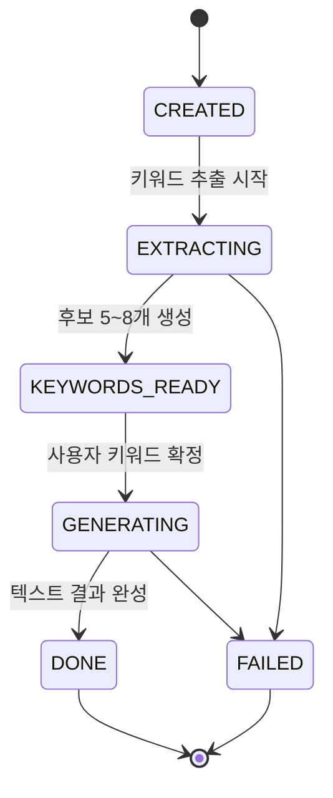

# GO. (고점) — ERD / 데이터베이스 설계서

| 항목 | 내용 |
| --- | --- |
| 문서 버전 | v1.0 |
| 최종 수정일 | 2026-08-13 |
| 상위 문서 | [PRD.md](PRD.md) |
| 짝 문서 | [API.md](API.md) — 본 문서의 컬럼과 API 필드는 1:1로 대응한다 |
| DBMS | PostgreSQL 16 |
| 마이그레이션 | Flyway (`src/main/resources/db/migration/V{n}__{name}.sql`) |
| ORM | Spring Data JPA · Hibernate 6 |

---

## 1. 설계 규칙

| # | 규칙 |
| --- | --- |
| D-1 | 테이블·컬럼은 `snake_case`, API JSON은 `camelCase`. 매핑은 Jackson `PropertyNamingStrategies.SNAKE_CASE` 미사용 — 엔티티 필드는 camelCase, 컬럼은 `@Column(name=...)`으로 명시한다. |
| D-2 | 모든 PK는 `UUID` (`gen_random_uuid()`, PG13+ 내장). 순차 ID 노출로 인한 열람 시도를 차단한다. |
| D-3 | 모든 테이블에 `created_at`, 변경 가능한 테이블에 `updated_at` (`TIMESTAMPTZ`). 시간은 **UTC 저장 / KST 표시**. |
| D-4 | **이미지 원본은 DB에 저장하지 않는다.** 오브젝트 스토리지 key만 저장하고 조회 시 presigned URL을 발급한다. |
| D-5 | 사용자 삭제는 **soft delete**(`deleted_at`) 후 배치로 하드 삭제. 단 **사진 객체는 즉시 삭제**한다. (PRD §10) |
| D-6 | AI 출력 중 **조회·필터·정렬 대상은 컬럼**, **표시 전용 덩어리는 JSONB**. §5 참조. |
| D-7 | Enum은 DB에서 `VARCHAR` + `CHECK` 제약으로 관리한다. PG enum 타입은 값 추가 시 마이그레이션이 번거로워 쓰지 않는다. |
| D-8 | 금액은 `INTEGER`(원 단위), 비율은 `NUMERIC(5,2)`. 부동소수 금액 금지. |

---

## 2. ERD

```mermaid
erDiagram
    users ||--o{ consents : "동의"
    users ||--o{ profiles : "프로필 이력"
    users ||--o{ analyses : "분석 요청"
    users ||--o{ saved_results : "서랍"
    users ||--o{ routines : "루틴"
    users ||--|| notification_settings : "알림 설정"
    users ||--o{ device_tokens : "기기"
    users ||--o{ subscriptions : "구독"

    profiles ||--o{ analyses : "기준 프로필"
    analyses ||--o{ analysis_keywords : "키워드 후보"
    analyses ||--|| analysis_results : "결과"
    analyses ||--o{ ai_jobs : "AI 호출"
    analysis_results ||--o| saved_results : "저장"
    analysis_results ||--o{ routines : "근거 결과"
    routines ||--o{ routine_tasks : "일자별 태스크"
    subscriptions ||--o{ payments : "결제"

    users {
        uuid id PK
        varchar email UK
        varchar password_hash "소셜 로그인 시 NULL"
        varchar provider "LOCAL|KAKAO|GOOGLE"
        varchar provider_user_id
        varchar nickname
        timestamptz deleted_at
        timestamptz created_at
    }

    consents {
        uuid id PK
        uuid user_id FK
        varchar code "TERMS|PRIVACY|BIOMETRIC|MARKETING"
        boolean required
        varchar version
        boolean agreed
        timestamptz agreed_at
    }

    profiles {
        uuid id PK
        uuid user_id FK
        varchar photo_key "오브젝트 스토리지 key"
        date birth_date
        varchar gender "MALE|FEMALE|UNSPECIFIED"
        smallint height_cm
        numeric weight_kg
        numeric sleep_hours "nullable"
        jsonb inbody "nullable"
        jsonb analysis_summary "AI 현재 상태 요약"
        boolean is_active
        timestamptz created_at
    }

    analyses {
        uuid id PK
        uuid user_id FK
        uuid profile_id FK
        varchar priority_category "SKIN|FACE|BODY|HEALTH|NULL"
        varchar input_mode "TEXT|TEXT_IMAGE"
        text input_text
        varchar reference_image_key "nullable"
        varchar status "CREATED..DONE|FAILED"
        varchar failure_code
        uuid retried_from FK "재분석 원본"
        timestamptz created_at
    }

    analysis_keywords {
        uuid id PK
        uuid analysis_id FK
        varchar label
        text reason
        varchar category "SKIN|FACE|BODY|HEALTH"
        varchar origin "TEXT|IMAGE|COMMON|CONFLICT"
        smallint display_order
        boolean selected
    }

    analysis_results {
        uuid id PK
        uuid analysis_id FK UK
        text summary
        smallint change_intensity "0~100"
        varchar intensity_label
        jsonb keep_points
        jsonb emphasize_points
        jsonb top_changes "3건"
        jsonb daily_cares
        jsonb recommended_routines
        varchar comparison_image_key "nullable"
        varchar image_status "SKIPPED|PENDING|DONE|FAILED"
        boolean liked
        timestamptz created_at
    }

    saved_results {
        uuid id PK
        uuid user_id FK
        uuid analysis_result_id FK UK
        timestamptz saved_at
    }

    routines {
        uuid id PK
        uuid user_id FK
        uuid analysis_result_id FK "nullable = 루틴만 생성"
        varchar category "SKIN|HEALTH|BODY"
        varchar title
        smallint duration_weeks "1~12"
        smallint per_week
        smallint minutes_per_day
        smallint priority_rank
        date start_date
        date end_date
        varchar status "ACTIVE|COMPLETED|CANCELED"
        timestamptz created_at
    }

    routine_tasks {
        uuid id PK
        uuid routine_id FK
        date scheduled_date
        time scheduled_time "nullable"
        varchar title
        text description
        varchar status "PENDING|DONE|MISSED|RESCHEDULED"
        date original_date "재배치 추적"
        smallint reschedule_count
        timestamptz completed_at
    }

    notification_settings {
        uuid id PK
        uuid user_id FK UK
        boolean enabled
        time default_time
        timestamptz updated_at
    }

    device_tokens {
        uuid id PK
        uuid user_id FK
        varchar token UK
        varchar platform "WEB|IOS|ANDROID"
        timestamptz created_at
    }

    subscriptions {
        uuid id PK
        uuid user_id FK
        varchar plan "TRIAL|MONTHLY|YEARLY"
        varchar status "ACTIVE|EXPIRED|CANCELED"
        smallint analysis_credits
        timestamptz started_at
        timestamptz expires_at
    }

    payments {
        uuid id PK
        uuid subscription_id FK
        varchar pg_transaction_id UK
        integer amount
        varchar status "PAID|FAILED|REFUNDED"
        timestamptz paid_at
    }

    ai_jobs {
        uuid id PK
        uuid analysis_id FK
        varchar stage "KEYWORD_EXTRACTION 등"
        varchar model
        varchar status "PENDING|DONE|FAILED"
        integer input_tokens
        integer output_tokens
        integer latency_ms
        varchar error_code
        timestamptz created_at
    }
```

---

## 3. 테이블 상세

### 3.1 `users`

| 컬럼 | 타입 | 제약 | 설명 |
| --- | --- | --- | --- |
| id | UUID | PK | |
| email | VARCHAR(255) | UNIQUE, NOT NULL | 소셜 로그인도 이메일 필수 |
| password_hash | VARCHAR(255) | NULL | BCrypt. 소셜 계정은 NULL |
| provider | VARCHAR(20) | NOT NULL, CHECK | `LOCAL` `KAKAO` `GOOGLE` |
| provider_user_id | VARCHAR(255) | NULL | 소셜 고유 ID. `(provider, provider_user_id)` UNIQUE |
| nickname | VARCHAR(20) | NOT NULL | 결과 화면 "{닉네임}님의 추구미" |
| deleted_at | TIMESTAMPTZ | NULL | soft delete (D-5) |
| created_at | TIMESTAMPTZ | NOT NULL | |

### 3.2 `consents`

PRD §10의 **필수/선택 동의 분리**를 위해 동의 항목을 행 단위로 저장한다. 약관 개정 시 `version`이 올라가고 재동의를 받는다.

| code | required | 설명 |
| --- | --- | --- |
| `TERMS` | true | 서비스 이용약관 |
| `PRIVACY` | true | 개인정보 수집·이용 |
| `BIOMETRIC` | true | 얼굴 사진(생체정보에 준함) 처리 |
| `MARKETING` | false | 마케팅 수신 |

> `required = true` 항목이 모두 `agreed = true`가 아니면 프로필 생성이 거부된다. `MARKETING` 미동의는 핵심 기능에 영향을 주지 않는다.

### 3.3 `profiles`

사용자당 여러 행이 존재할 수 있으나 **`is_active = true`는 최대 1행**이다. 사진을 다시 등록하면 기존 행을 비활성화하고 새 행을 만든다. 과거 분석은 그 시점의 `profile_id`를 그대로 참조하므로 결과 재현이 가능하다.

| 컬럼 | 타입 | 제약 | 설명 |
| --- | --- | --- | --- |
| photo_key | VARCHAR(512) | NOT NULL | 예: `profiles/{userId}/{uuid}.jpg` |
| birth_date | DATE | NOT NULL | 만 14세 이상 (앱·서버 이중 검증) |
| gender | VARCHAR(20) | CHECK | `MALE` `FEMALE` `UNSPECIFIED` |
| height_cm | SMALLINT | CHECK 100~250 | |
| weight_kg | NUMERIC(4,1) | CHECK 30~200 | |
| sleep_hours | NUMERIC(3,1) | NULL, CHECK 0~14 | 0.5 단위 |
| inbody | JSONB | NULL | §5.1 |
| analysis_summary | JSONB | NULL | §5.2. 생성 전에는 NULL |
| is_active | BOOLEAN | NOT NULL | 부분 유니크 인덱스로 1행 보장 |

### 3.4 `analyses`

`status`는 비동기 파이프라인의 단일 진실 공급원이다. 프론트는 이 값만 폴링한다.



- 이미지 생성은 이 상태와 **분리**된다. `analysis_results.image_status`로 별도 추적하며, 이미지가 실패해도 `status`는 `DONE`이다. (PRD §8.1)
- `retried_from`은 "다시 분석하기"로 생성된 행이 원본을 가리킨다. 프로필은 재사용하므로 사진 재등록이 발생하지 않는다. (PRD R-1)
- `failure_code`는 API 에러 코드와 동일 문자열을 쓴다. ([API.md](API.md) §4)

### 3.5 `analysis_keywords`

- 한 분석당 5~8행. `display_order`로 노출 순서를 고정한다.
- `origin = CONFLICT`인 키워드는 텍스트와 사진의 방향이 어긋나는 항목으로, UI에서 별도 그룹으로 표시한다. (PRD F-05)
- `selected`는 사용자가 확정한 키워드에만 `true`. **AI가 기본 선택 상태를 만들지 않는다.** (PRD F-06)
- 제약: 선택 개수 1~4개는 애플리케이션 레이어에서 검증한다.

### 3.6 `analysis_results`

결과 화면(PRD F-07) 9개 블록과 1:1 대응한다.

| 컬럼 | 대응 블록 |
| --- | --- |
| summary | ② 타이틀 하단 한 줄 요약 |
| comparison_image_key, image_status | ③ 비교 이미지 |
| keep_points, emphasize_points, change_intensity, intensity_label | ④ 한눈에 보는 추구미 |
| top_changes | ⑤ 이렇게 바꾸면 가까워져요 |
| daily_cares | ⑥ 오늘부터 해볼 관리 |
| recommended_routines | ⑦ 추천 맞춤 루틴 |
| liked | ⑧ 결과 피드백 |

- `change_intensity`는 0~100 정수, `intensity_label`은 `자연스럽게` / `또렷하게` 등 표시 문구. **산출 로직은 PRD O-5로 미결**이며, 확정 전까지 AI 출력값을 그대로 저장한다.
- `image_status = SKIPPED`는 텍스트만 입력한 분석(`input_mode = TEXT`)을 뜻한다. 이 경우 프론트는 ③ 블록을 렌더링하지 않는다.
- `liked = false` 상태의 결과는 서랍에 저장되지 않는다. (PRD R-4)

### 3.7 `routines` / `routine_tasks`

- `category`는 **3종**(`SKIN` `HEALTH` `BODY`)이다. 우선순위는 4종이지만 `FACE`는 루틴이 아닌 변화 Top 3로만 반영된다. (PRD O-4)
- `duration_weeks`는 1~12. `end_date = start_date + duration_weeks * 7 - 1`.
- `priority_rank` 1·2는 결과 화면의 `우선 1` `우선 2` 뱃지, 3 이상은 `선택`.
- **미수행 재배치**(PRD F-10)
  - 자정 배치가 `scheduled_date < 오늘` AND `status = PENDING`인 태스크를 `MISSED`로 전환한다.
  - `MISSED` 태스크는 다음 가능한 날짜로 복제되며, 원본은 `RESCHEDULED`가 되고 신규 행에 `original_date`와 `reschedule_count + 1`을 기록한다.
  - **`end_date`를 넘겨 연장하지 않는다.** 기간 내 재배치가 불가능하면 `MISSED`로 확정한다.
  - 동일 루틴에서 `MISSED`가 연속 3회 발생하면 "강도 낮추기" 제안을 노출한다. (판정은 조회 시 계산, 별도 컬럼 없음)

### 3.8 `subscriptions`

- `analysis_credits`는 남은 분석권. **차감 시점은 결과 생성 성공 시**이며 실패 시 차감하지 않는다. (PRD O-6)
- 차감은 `UPDATE ... SET analysis_credits = analysis_credits - 1 WHERE id = ? AND analysis_credits > 0` 단일 문으로 처리해 동시 요청 중복 차감을 막는다.
- 구독 만료 후에도 저장된 결과·루틴은 **조회 가능**, 신규 분석·루틴 생성만 차단한다. (PRD F-12)

### 3.9 `ai_jobs`

OpenAI 호출 1건 = 1행. 비용 추적·재시도·장애 분석용이다.

- `stage`: `PROFILE_ANALYSIS` `KEYWORD_EXTRACTION` `RESULT_GENERATION` `IMAGE_GENERATION` `ROUTINE_GENERATION`
- **프롬프트 원문과 사용자 사진은 저장하지 않는다.** 토큰 수·지연시간·에러코드만 남긴다. (PRD §9 로깅 규칙)

---

## 4. 인덱스

```sql
CREATE UNIQUE INDEX ux_users_provider     ON users(provider, provider_user_id) WHERE provider_user_id IS NOT NULL;
CREATE UNIQUE INDEX ux_profiles_active    ON profiles(user_id) WHERE is_active;
CREATE UNIQUE INDEX ux_consents_user_code ON consents(user_id, code);
CREATE        INDEX ix_analyses_user      ON analyses(user_id, created_at DESC);
CREATE        INDEX ix_analyses_status    ON analyses(status) WHERE status IN ('CREATED','EXTRACTING','GENERATING');
CREATE        INDEX ix_keywords_analysis  ON analysis_keywords(analysis_id, display_order);
CREATE UNIQUE INDEX ux_results_analysis   ON analysis_results(analysis_id);
CREATE UNIQUE INDEX ux_saved_result       ON saved_results(analysis_result_id);
CREATE        INDEX ix_saved_user         ON saved_results(user_id, saved_at DESC);
CREATE        INDEX ix_routines_user      ON routines(user_id, status);
CREATE        INDEX ix_tasks_routine_date ON routine_tasks(routine_id, scheduled_date);
CREATE        INDEX ix_tasks_pending      ON routine_tasks(scheduled_date) WHERE status = 'PENDING';
CREATE        INDEX ix_ai_jobs_analysis   ON ai_jobs(analysis_id, stage);
```

- `ix_analyses_status`는 진행 중 분석만 담는 **부분 인덱스**다. 폴링 쿼리와 좀비 잡 정리 배치가 함께 사용한다.
- `ix_tasks_pending`은 알림 발송·미수행 판정 배치의 기준 인덱스다.

---

## 5. JSONB 컬럼 스키마

JSONB에 넣는 값은 **표시 전용**이다. 이 안의 값으로 필터링·정렬하는 쿼리를 만들지 않는다. 필요해지면 컬럼으로 승격한다. (D-6)

### 5.1 `profiles.inbody`

```json
{ "skeletalMuscleKg": 28.4, "bodyFatRate": 22.1, "bmi": 21.8 }
```

### 5.2 `profiles.analysis_summary`

```json
{
  "faceImpression": ["부드러운 얼굴선", "자연스러운 표정"],
  "bodyRange": "표준 범위",
  "healthNotes": ["평균 수면 6.5시간 · 사용자 입력 기준"],
  "modelVersion": "gpt-4.1-2025-04-14",
  "analyzedAt": "2026-08-10T04:12:00Z"
}
```

> **점수·등급 필드를 두지 않는다.** (PRD G-1)

### 5.3 `analysis_results.keep_points` / `emphasize_points`

```json
["부드러운 얼굴선과 자연스러운 표정"]
```

### 5.4 `analysis_results.top_changes`

정확히 3개 원소. `rank`는 1~3.

```json
[
  {
    "rank": 1,
    "title": "눈썹선을 조금 더 선명하게",
    "description": "완만한 일자형으로 정돈하면 차분하면서 또렷한 인상이 살아나요. 진한 색보다 현재 모발과 비슷한 색을 추천해요.",
    "tag": "STYLING"
  }
]
```

`tag`: `STYLING`(스타일링) · `SELF_CARE`(셀프 관리) · `CARE`(케어)

### 5.5 `analysis_results.daily_cares`

```json
[{ "title": "수분 진정 루틴", "description": "아침에는 자외선 관리, 저녁에는 보습 단계를 단순하게 유지해 보세요." }]
```

### 5.6 `analysis_results.recommended_routines`

결과 화면 ⑦ 블록. 사용자가 여기서 선택한 항목이 `routines` 행으로 확정된다.

```json
[
  {
    "category": "SKIN",
    "title": "피부·수분 균형 루틴",
    "recommendedWeeks": 4,
    "minutesPerDay": 8,
    "perWeek": 6,
    "priorityRank": 1
  }
]
```

---

## 6. Flyway 초기 마이그레이션 (`V1__init.sql`)

```sql
CREATE EXTENSION IF NOT EXISTS pgcrypto;

CREATE TABLE users (
    id               UUID PRIMARY KEY DEFAULT gen_random_uuid(),
    email            VARCHAR(255) NOT NULL UNIQUE,
    password_hash    VARCHAR(255),
    provider         VARCHAR(20)  NOT NULL CHECK (provider IN ('LOCAL','KAKAO','GOOGLE')),
    provider_user_id VARCHAR(255),
    nickname         VARCHAR(20)  NOT NULL,
    deleted_at       TIMESTAMPTZ,
    created_at       TIMESTAMPTZ  NOT NULL DEFAULT now(),
    updated_at       TIMESTAMPTZ  NOT NULL DEFAULT now()
);

CREATE TABLE consents (
    id        UUID PRIMARY KEY DEFAULT gen_random_uuid(),
    user_id   UUID NOT NULL REFERENCES users(id) ON DELETE CASCADE,
    code      VARCHAR(20) NOT NULL CHECK (code IN ('TERMS','PRIVACY','BIOMETRIC','MARKETING')),
    required  BOOLEAN     NOT NULL,
    version   VARCHAR(20) NOT NULL,
    agreed    BOOLEAN     NOT NULL,
    agreed_at TIMESTAMPTZ
);

CREATE TABLE profiles (
    id               UUID PRIMARY KEY DEFAULT gen_random_uuid(),
    user_id          UUID NOT NULL REFERENCES users(id) ON DELETE CASCADE,
    photo_key        VARCHAR(512) NOT NULL,
    birth_date       DATE         NOT NULL,
    gender           VARCHAR(20)  NOT NULL CHECK (gender IN ('MALE','FEMALE','UNSPECIFIED')),
    height_cm        SMALLINT     NOT NULL CHECK (height_cm BETWEEN 100 AND 250),
    weight_kg        NUMERIC(4,1) NOT NULL CHECK (weight_kg BETWEEN 30 AND 200),
    sleep_hours      NUMERIC(3,1) CHECK (sleep_hours BETWEEN 0 AND 14),
    inbody           JSONB,
    analysis_summary JSONB,
    is_active        BOOLEAN      NOT NULL DEFAULT TRUE,
    created_at       TIMESTAMPTZ  NOT NULL DEFAULT now()
);

CREATE TABLE analyses (
    id                  UUID PRIMARY KEY DEFAULT gen_random_uuid(),
    user_id             UUID NOT NULL REFERENCES users(id) ON DELETE CASCADE,
    profile_id          UUID NOT NULL REFERENCES profiles(id),
    priority_category   VARCHAR(10) CHECK (priority_category IN ('SKIN','FACE','BODY','HEALTH')),
    input_mode          VARCHAR(20) NOT NULL CHECK (input_mode IN ('TEXT','TEXT_IMAGE')),
    input_text          TEXT        NOT NULL CHECK (char_length(input_text) BETWEEN 10 AND 300),
    reference_image_key VARCHAR(512),
    status              VARCHAR(20) NOT NULL DEFAULT 'CREATED'
                        CHECK (status IN ('CREATED','EXTRACTING','KEYWORDS_READY','GENERATING','DONE','FAILED')),
    failure_code        VARCHAR(50),
    retried_from        UUID REFERENCES analyses(id),
    created_at          TIMESTAMPTZ NOT NULL DEFAULT now(),
    updated_at          TIMESTAMPTZ NOT NULL DEFAULT now(),
    CONSTRAINT ck_reference_image CHECK (input_mode = 'TEXT' OR reference_image_key IS NOT NULL)
);

CREATE TABLE analysis_keywords (
    id            UUID PRIMARY KEY DEFAULT gen_random_uuid(),
    analysis_id   UUID NOT NULL REFERENCES analyses(id) ON DELETE CASCADE,
    label         VARCHAR(40) NOT NULL,
    reason        TEXT        NOT NULL,
    category      VARCHAR(10) NOT NULL CHECK (category IN ('SKIN','FACE','BODY','HEALTH')),
    origin        VARCHAR(10) NOT NULL CHECK (origin IN ('TEXT','IMAGE','COMMON','CONFLICT')),
    display_order SMALLINT    NOT NULL,
    selected      BOOLEAN     NOT NULL DEFAULT FALSE
);

CREATE TABLE analysis_results (
    id                   UUID PRIMARY KEY DEFAULT gen_random_uuid(),
    analysis_id          UUID NOT NULL REFERENCES analyses(id) ON DELETE CASCADE,
    summary              TEXT     NOT NULL,
    change_intensity     SMALLINT NOT NULL CHECK (change_intensity BETWEEN 0 AND 100),
    intensity_label      VARCHAR(20) NOT NULL,
    keep_points          JSONB    NOT NULL DEFAULT '[]',
    emphasize_points     JSONB    NOT NULL DEFAULT '[]',
    top_changes          JSONB    NOT NULL DEFAULT '[]',
    daily_cares          JSONB    NOT NULL DEFAULT '[]',
    recommended_routines JSONB    NOT NULL DEFAULT '[]',
    comparison_image_key VARCHAR(512),
    image_status         VARCHAR(20) NOT NULL DEFAULT 'PENDING'
                         CHECK (image_status IN ('SKIPPED','PENDING','DONE','FAILED')),
    liked                BOOLEAN,
    created_at           TIMESTAMPTZ NOT NULL DEFAULT now()
);

CREATE TABLE saved_results (
    id                 UUID PRIMARY KEY DEFAULT gen_random_uuid(),
    user_id            UUID NOT NULL REFERENCES users(id) ON DELETE CASCADE,
    analysis_result_id UUID NOT NULL REFERENCES analysis_results(id) ON DELETE CASCADE,
    saved_at           TIMESTAMPTZ NOT NULL DEFAULT now()
);

CREATE TABLE routines (
    id                 UUID PRIMARY KEY DEFAULT gen_random_uuid(),
    user_id            UUID NOT NULL REFERENCES users(id) ON DELETE CASCADE,
    analysis_result_id UUID REFERENCES analysis_results(id),
    category           VARCHAR(10) NOT NULL CHECK (category IN ('SKIN','HEALTH','BODY')),
    title              VARCHAR(60) NOT NULL,
    duration_weeks     SMALLINT    NOT NULL CHECK (duration_weeks BETWEEN 1 AND 12),
    per_week           SMALLINT    NOT NULL CHECK (per_week BETWEEN 1 AND 7),
    minutes_per_day    SMALLINT    NOT NULL,
    priority_rank      SMALLINT    NOT NULL DEFAULT 3,
    start_date         DATE        NOT NULL,
    end_date           DATE        NOT NULL,
    status             VARCHAR(20) NOT NULL DEFAULT 'ACTIVE'
                       CHECK (status IN ('ACTIVE','COMPLETED','CANCELED')),
    created_at         TIMESTAMPTZ NOT NULL DEFAULT now()
);

CREATE TABLE routine_tasks (
    id               UUID PRIMARY KEY DEFAULT gen_random_uuid(),
    routine_id       UUID NOT NULL REFERENCES routines(id) ON DELETE CASCADE,
    scheduled_date   DATE NOT NULL,
    scheduled_time   TIME,
    title            VARCHAR(60) NOT NULL,
    description      TEXT,
    status           VARCHAR(20) NOT NULL DEFAULT 'PENDING'
                     CHECK (status IN ('PENDING','DONE','MISSED','RESCHEDULED')),
    original_date    DATE,
    reschedule_count SMALLINT NOT NULL DEFAULT 0,
    completed_at     TIMESTAMPTZ
);

CREATE TABLE notification_settings (
    id           UUID PRIMARY KEY DEFAULT gen_random_uuid(),
    user_id      UUID NOT NULL UNIQUE REFERENCES users(id) ON DELETE CASCADE,
    enabled      BOOLEAN NOT NULL DEFAULT FALSE,
    default_time TIME    NOT NULL DEFAULT '21:00',
    updated_at   TIMESTAMPTZ NOT NULL DEFAULT now()
);

CREATE TABLE device_tokens (
    id         UUID PRIMARY KEY DEFAULT gen_random_uuid(),
    user_id    UUID NOT NULL REFERENCES users(id) ON DELETE CASCADE,
    token      VARCHAR(512) NOT NULL UNIQUE,
    platform   VARCHAR(10)  NOT NULL CHECK (platform IN ('WEB','IOS','ANDROID')),
    created_at TIMESTAMPTZ  NOT NULL DEFAULT now()
);

CREATE TABLE subscriptions (
    id               UUID PRIMARY KEY DEFAULT gen_random_uuid(),
    user_id          UUID NOT NULL REFERENCES users(id) ON DELETE CASCADE,
    plan             VARCHAR(10) NOT NULL CHECK (plan IN ('TRIAL','MONTHLY','YEARLY')),
    status           VARCHAR(10) NOT NULL CHECK (status IN ('ACTIVE','EXPIRED','CANCELED')),
    analysis_credits SMALLINT    NOT NULL DEFAULT 1 CHECK (analysis_credits >= 0),
    started_at       TIMESTAMPTZ NOT NULL DEFAULT now(),
    expires_at       TIMESTAMPTZ
);

CREATE TABLE payments (
    id                UUID PRIMARY KEY DEFAULT gen_random_uuid(),
    subscription_id   UUID NOT NULL REFERENCES subscriptions(id),
    pg_transaction_id VARCHAR(100) NOT NULL UNIQUE,
    amount            INTEGER      NOT NULL,
    status            VARCHAR(10)  NOT NULL CHECK (status IN ('PAID','FAILED','REFUNDED')),
    paid_at           TIMESTAMPTZ
);

CREATE TABLE ai_jobs (
    id            UUID PRIMARY KEY DEFAULT gen_random_uuid(),
    analysis_id   UUID REFERENCES analyses(id) ON DELETE CASCADE,
    stage         VARCHAR(30) NOT NULL,
    model         VARCHAR(60) NOT NULL,
    status        VARCHAR(10) NOT NULL CHECK (status IN ('PENDING','DONE','FAILED')),
    input_tokens  INTEGER,
    output_tokens INTEGER,
    latency_ms    INTEGER,
    error_code    VARCHAR(50),
    created_at    TIMESTAMPTZ NOT NULL DEFAULT now()
);
```

---

## 7. 개인정보 관련 데이터 처리

| 요구 (PRD §10) | 구현 |
| --- | --- |
| 사진 삭제 | `DELETE /api/v1/profiles/me/photo` → 스토리지 객체 즉시 삭제, `photo_key`를 NULL로. 기존 분석 결과의 비교 이미지는 별도 삭제 대상 |
| 계정 삭제 | `users.deleted_at` 기록 + **모든 이미지 객체 즉시 삭제** → 30일 후 배치로 행 하드 삭제 |
| 필수/선택 동의 분리 | `consents.required` |
| 만 14세 미만 차단 | `birth_date` 서버 검증. 위반 시 `PROFILE_UNDERAGE` |
| 저장 리전 | 오브젝트 스토리지는 **국내 리전**. 해외 리전 사용 시 국외 이전 동의 항목 추가 필요 |
| 로그 분리 | `ai_jobs`에 프롬프트 원문·이미지 미저장 |

---

## 8. 미결 사항

| # | 내용 | 영향 |
| --- | --- | --- |
| E-1 | `change_intensity` 산출식 미정 (PRD O-5) | 현재는 AI 출력값 그대로 저장. 확정 시 계산 로직을 서버로 이관 |
| E-2 | 소셜 로그인 제공자 확정 (KAKAO/GOOGLE 중 무엇을 MVP에 넣을지) | `provider` CHECK 제약 조정 |
| E-3 | PG사 미정 | `payments` 컬럼이 PG 응답 스펙에 따라 변경될 수 있음 |
| E-4 | 루틴 태스크 생성 시점 — 전체 기간 일괄 생성 vs 주 단위 생성 | 현재 설계는 **생성 시 전체 기간 일괄**. 12주 × 7일 = 최대 84행/루틴 |
