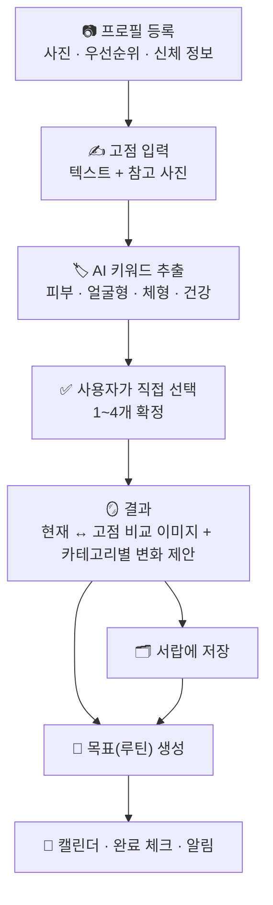
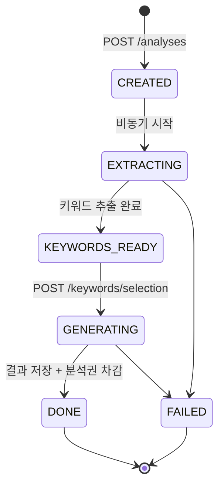

<div align="center">

# ✨ GO. (고점)

### 남을 닮지 말고, 나다운 분위기의 고점으로.

사용자의 **현재 사진 · 신체 정보**와 원하는 **고점**(이상적인 자기 이미지)을 AI로 비교 분석해,<br/>
나에게 자연스럽게 어울리는 **변화 전략**과 **실행 가능한 목표**를 만들어 주는 이미지 전략 서비스.

[](https://likelion.net/)


</div>

---

## 📑 목차

| | | |
| --- | --- | --- |
| [💡 서비스 소개](#-서비스-소개) | [🏗️ 시스템 아키텍처](#️-시스템-아키텍처) | [⚡ 로컬 실행](#-로컬-실행) |
| [🚀 핵심 경험](#-핵심-경험) | [🔄 고점 분석 파이프라인](#-고점-분석-파이프라인) | [🔐 환경 변수](#-환경-변수) |
| [🌟 주요 기능](#-주요-기능) | [🤖 AI 연동과 가드레일](#-ai-연동과-가드레일) | [🧪 테스트와 품질](#-테스트와-품질) |
| [🧭 서비스 원칙](#-서비스-원칙--타협하지-않는-것) | [🗄️ 데이터 모델](#️-데이터-모델) | [🚢 배포](#-배포) |
| [🛠️ 기술 스택](#️-기술-스택) | [🔌 API 개요](#-api-개요) | [🌿 브랜치 전략](#-브랜치-전략) |
| [📁 프로젝트 구조](#-프로젝트-구조) | [📚 문서 맵](#-문서-맵) | [🦁 프로젝트 정보](#-프로젝트-정보) |

---

## 💡 서비스 소개

닮고 싶은 사람은 있는데, 그 사람이 되는 것이 목표는 아닙니다. **GO.** 는 원하는 분위기를
**피부 · 체형 · 건강** 세 요소로 분해하고, 지금의 나에게 적용할 방법을 순서대로 알려 줍니다.

| 하는 것 | 하지 않는 것 |
| --- | --- |
| 분위기를 구성 요소로 **해석**한다 | 외모를 **점수 · 등급 · 순위**로 매긴다 |
| 참고 이미지의 스타일을 나에게 **적용**한다 | 참고 이미지 속 타인의 **얼굴을 복제**한다 |
| 오늘 시도할 수 있는 **행동**을 제안한다 | 의료 행위(진단 · 시술 · 처방)를 **권유**한다 |
| AI 추천 위에 **사용자의 선택**을 둔다 | AI가 고른 것을 기본값으로 밀어 넣는다 |

---

## 🚀 핵심 경험



---

## 🌟 주요 기능

| 도메인 | 기능 |
| --- | --- |
| **온보딩 · 프로필** | 얼굴 사진 등록(서버 측 얼굴 검출로 사전 검증) · 우선순위(피부/체형/건강) 정렬 · 키/몸무게/수면 입력 |
| **인바디 스캔** | 인바디 서류를 카메라로 찍으면 AI가 6종 수치를 읽어 **입력값 초안**으로 제안 (자동 저장하지 않음) |
| **고점 분석** | 텍스트 10~500자 + 참고 사진 N장 → 키워드 후보 추출 → 사용자 확정 → 결과 생성 |
| **비교 이미지** | 사용자 사진을 기준으로 한 합성 이미지. 실패해도 텍스트 결과는 그대로 제공 |
| **결과** | 유지할 점 · 강조할 점 · 카테고리 3종 변화 제안 · 오늘 해볼 관리 · 면책 문구(항상 노출) |
| **서랍** | 저장한 결과를 3섹션으로 보관 · 상세 조회 · 삭제 |
| **목표(루틴)** | 분석 결과에서 생성(경로 A) 또는 단독 생성(경로 B) · **필수/보조/선택** 구분과 근거 표시 |
| **진행 관리** | 주간 캘린더 · 태스크 완료 체크 · 진행률 · 목표별 알림 시각 설정 |
| **상품 추천** | 결과에 어울리는 상품을 카탈로그 안에서 선택 (없는 상품을 지어내지 않음) |
| **계정** | 이메일 가입 · Google 로그인 · 닉네임 변경 · 계정 삭제(사진·객체까지 실삭제) |
| **구독** | 무료 체험 분석권 · 유료 전환 · 분석권 잔여 관리 |

---

## 🧭 서비스 원칙 — 타협하지 않는 것

> 이 원칙들은 문구가 아니라 **코드로 강제**됩니다. 프롬프트에만 적어 두지 않습니다.

1. **점수화 금지** — "72점", "상위 20%" 같은 표현은 UI·문구·AI 출력 어디에도 없습니다. 서버가 출력을 정규식으로 후검증하고, 걸리면 재생성합니다.
2. **면책 문구 상시 노출** — 결과 화면의 면책 문구는 숨기거나 접을 수 없습니다.
3. **타인의 얼굴을 복제하지 않음** — 비교 이미지의 합성 경계는 아래와 같이 고정되어 있습니다.

| 참고 사진에서 가져오는 것 | 사용자 사진에서 지키는 것 |
| --- | --- |
| 헤어스타일 (길이 · 형태 · 앞머리 · 컬 · 색) | 이목구비의 형태와 배치, 얼굴 골격 |
| 피부 **상태** (결 · 균일함 · 생기) | 나이 · 인종 · 성별 · 체형 · 고유 **피부색** |
| 전체 분위기와 색감 | 옷 · 액세서리 · 배경 |

> 피부는 **상태**만 가져오고 **색**은 바꾸지 않습니다. 피부색은 인종과 얽혀 있어
> "인종을 바꾸지 않는다"와 충돌하기 때문입니다.

4. **의료 표현 금지** — 치료 · 시술 · 진단 · 처방 등 금지어를 서버가 후검증합니다.
5. **개인정보** — 얼굴 사진은 생체정보에 준해 다룹니다. 로그·에러 리포팅에 이미지 URL이나 object key를 남기지 않고, 스토리지 리전은 국내(ap-northeast-2)로 고정합니다.

---

## 🛠️ 기술 스택

### Frontend — Expo React Native

| 영역 | 사용 기술 |
| --- | --- |
| 런타임 | **Expo SDK 54** · React Native 0.81.5 · React 19.1.0 |
| 언어 | **TypeScript 5.9** (strict) · `@/*` → `frontend/src/*` 경로 별칭 |
| 라우팅 | **Expo Router 6** 파일 기반 라우팅 (`typedRoutes`, React Compiler 실험 기능 활성화) |
| 상태 | React Context (`src/state/AppState.tsx`) + AsyncStorage 2.2 세션 |
| 네트워크 | 자체 HTTP 래퍼 (`src/services/api.ts`) — 응답 봉투 해제 · 토큰 주입 · 401 시 refresh 후 1회 재시도 · 타임아웃 |
| 인증 | `@react-native-google-signin/google-signin` 16 (네이티브) + 웹 전용 구현 분기 |
| 미디어 | expo-image-picker · expo-image · expo-blur · react-native-svg 15 |
| 알림 | expo-notifications (Expo Push 토큰 등록) |
| 폰트 | Pretendard 5종 로컬 번들 (expo-font) |
| 빌드·배포 | **EAS Build** (development / preview / production 프로필) · Expo 웹 static export |
| 품질 | Jest 29 + jest-expo · ESLint 9 + eslint-config-expo · `tsc --noEmit` |
| 재현성 | Node **24.15.0** 고정(`.nvmrc` · `.node-version`) · `package-lock.json` + `npm ci` |

### Backend — Spring Boot

| 영역 | 사용 기술 |
| --- | --- |
| 런타임 | **Java 21** (Gradle toolchain) · **Spring Boot 3.3.5** · Gradle 8.10.2 (Wrapper) |
| 웹 | spring-boot-starter-web · starter-validation · `RestClient` (Spring 6.1+) |
| 영속성 | Spring Data JPA · Hibernate 6 · **`open-in-view: false`** · HikariCP (pool 20) |
| 마이그레이션 | **Flyway 10** (`flyway-core` + `flyway-database-postgresql`) · `ddl-auto: validate` |
| 보안 | Spring Security · **JJWT 0.12.6** (HS256, Access 30분 / Refresh 14일) |
| 소셜 로그인 | `google-api-client` 2.7.0 — Google **ID 토큰 검증** 방식 (클라이언트 시크릿 불필요, JWKS 캐싱·키 롤오버 위임) |
| 스토리지 | **AWS SDK v2 2.29.9** (`s3` + `S3Presigner`) — S3 호환 오브젝트 스토리지 |
| 이미지 검증 | **OpenCV 4.9** (OpenPnP 네이티브 번들) + OpenCV frontal-face cascade — 업로드 사진의 얼굴 검출 |
| 비동기 | `@Async` 전용 스레드 풀 2종(텍스트 / 이미지) + `@TransactionalEventListener(AFTER_COMMIT)` |
| 스케줄링 | `@Scheduled` 스위퍼 3종 (좀비 분석 · 루틴 알림 · 스토리지 삭제 재시도) |
| 운영 | Spring Boot Actuator (`/actuator/health`만 노출) |
| 보조 | Lombok |
| 테스트 | JUnit 5 · spring-security-test · **Testcontainers 1.21.4 (PostgreSQL)** · 단위/통합 태스크 분리 |

### AI

| 영역 | 사용 기술 |
| --- | --- |
| 공급자 | OpenAI — `/v1/chat/completions` (텍스트·비전), `/v1/images/edits` (비교 이미지) |
| 출력 강제 | **Structured Outputs** (`json_schema`, `strict: true`) — 자유 서술을 정규식으로 파싱하지 않음 |
| 모델 관리 | 모델 ID **하드코딩 금지**. `OPENAI_MODEL_TEXT` / `_VISION` / `_IMAGE` 환경 변수로 핀 고정하고 실제 사용값을 `ai_jobs`에 기록 |
| 호출 정책 | connect 5초 / read 60초 · 429·5xx만 최대 2회 지수 백오프 재시도 (4xx는 재시도 없음) |
| 가드레일 | `OutputValidator`(점수 패턴·금지어) · `TruncationDetector`(잘린 응답) · enum 기반 스키마 생성 |
| 관측 | `AiJobRecorder` — 단계 · 모델 · 토큰 · 지연 · 에러코드 기록 (**프롬프트 원문·사진은 저장하지 않음**) |

### Data · Storage · Infra

| 영역 | 사용 기술 |
| --- | --- |
| DB | **PostgreSQL 16** (로컬은 docker-compose) · JSONB 적극 사용 |
| 오브젝트 스토리지 | S3 호환 (ap-northeast-2) · presigned **PUT 5분 / GET 10분** · 업로드 10MB 상한 |
| 서버 | Ubuntu (가비아 클라우드, 2vCore / 4GB) · systemd 서비스 |
| 프록시 · TLS | nginx 리버스 프록시 (443 → 8080) · Let's Encrypt (certbot 자동 갱신) |
| 웹 배포 | `expo export -p web` 정적 산출물을 nginx가 서빙 |
| 앱 배포 | EAS Build → Android APK (internal distribution) |
| 푸시 | Expo Push Service (`exp.host`) → Android는 FCM 경유 |

---

## 🏗️ 시스템 아키텍처

```text
      Expo App (Android)              Expo Web (static export)
              │                                  │
              └────────── HTTPS / JSON ──────────┴──────────┐
                                                            ▼
        ┌───────────────────────────────────────────────────────────┐
        │                     Spring Boot API                       │
        │             Controller  →  Service  →  Repository         │
        └────────────────────────────┬──────────────────────────────┘
                                     ├──▶ PostgreSQL 16      JPA · Flyway
                                     ├──▶ OpenAI API         Structured Outputs · Image Edits
                                     ├──▶ S3 Presigner       업로드 5분 · 조회 10분
                                     └──▶ Expo Push ─▶ FCM   루틴 알림
```

**이미지 바이트는 API 서버를 통과하지 않습니다.** 클라이언트가 presigned URL로
Object Storage(S3 호환 · ap-northeast-2)와 직접 PUT / GET 하고, DB에는 object key만 남습니다.

### 설계 원칙

| # | 원칙 | 이유 |
| --- | --- | --- |
| A-1 | **이미지 바이트가 API 서버·DB를 통과하지 않는다** | 업로드·다운로드 모두 presigned URL. DB에는 object key만 저장 |
| A-2 | **AI 호출은 전부 비동기다** | HTTP 요청은 작업을 등록하고 즉시 `202`를 반환 |
| A-3 | **상태는 DB가 유일한 진실이다** | 메모리 큐·세션에 진행 상태를 두지 않는다 (재시작 내성) |
| A-4 | **가드레일은 프롬프트에 의존하지 않는다** | 서버가 출력을 후검증한다 |
| A-5 | **외부 API 호출을 트랜잭션 안에서 하지 않는다** | OpenAI 응답이 수십 초 걸린다. 커넥션 풀이 마른다 |
| A-6 | **Entity를 컨트롤러 밖으로 내보내지 않는다** | 경계는 항상 DTO |
| A-7 | **스키마는 Flyway가 소유한다** | `ddl-auto: validate`. 엔티티를 바꾸면 마이그레이션을 함께 추가 |

---

## 🔄 고점 분석 파이프라인

이 서비스의 심장부입니다. HTTP 요청은 즉시 반환되고, 실제 작업은 비동기로 진행됩니다.



| 구간 | 서버가 하는 일 |
| --- | --- |
| `CREATED` | 프로필 존재 · 분석권 잔여 검증 후 행 생성, 커밋 직후 비동기 시작 |
| `EXTRACTING` | 트랜잭션 **밖**에서 OpenAI 키워드 추출 → 짧은 트랜잭션으로 저장 |
| `KEYWORDS_READY` | 사용자가 키워드를 고르는 동안 머무는 상태. **시간 제한을 걸지 않는다** |
| `GENERATING` | 결과 생성 → 가드레일 후검증 → 결과 저장·분석권 차감을 **같은 트랜잭션**에서 처리 |
| `DONE` | 비교 이미지는 별도 스레드 풀에서 생성되며 `ImageStatus`로 따로 추적 |

### 신뢰성 장치

- **좀비 분석 정리** — 앱이 재시작되면 진행 중이던 `@Async` 작업은 사라집니다. `AnalysisSweeper`가 3분 이상 진행 상태에 머문 분석을 `FAILED`로 전환하고, **분석권은 차감하지 않습니다.**
- **분석권 중복 차감 방지** — 조회 후 저장이 아니라 조건부 **단일 UPDATE**로 감소시킵니다. 영향 행이 0이면 잔여 없음으로 판단합니다.
- **이미지 실패는 정상 시나리오** — 정책 거부·생성 실패는 예외로 던지지 않고 `image_status = FAILED`로 저장한 뒤 텍스트 결과만 응답합니다. 이것은 분석권 미차감 사유가 아닙니다.
- **트랜잭션 프록시 분리** — `@Transactional` 메서드는 별도 빈(`AnalysisTxService` 등)에 둡니다. 같은 클래스 내부 호출은 프록시를 타지 않기 때문입니다.
- **스토리지 삭제 큐** — 사진·계정 삭제는 `storage_deletion_jobs`에 적재하고 스위퍼가 재시도합니다. 실패해도 객체가 고아로 남지 않습니다.

> **MVP 전제** — 단일 인스턴스 운영. 다중 인스턴스로 확장하면 `@Async`를 메시지 큐로,
> 스케줄러는 분산 락(ShedLock 등)으로 바꿔야 합니다.

---

## 🤖 AI 연동과 가드레일

### 단계

| 단계 (`AiStage`) | 하는 일 | 모델 |
| --- | --- | --- |
| `PROFILE_ANALYSIS` | 얼굴 사진 1회 판독 → 이후 모든 단계가 참조할 요약 생성 | **vision** (상위 모델) |
| `INBODY_OCR` | 인바디 서류에서 6종 수치 추출 (읽지 못한 항목은 `null`) | text |
| `KEYWORD_EXTRACTION` | 고점 텍스트·참고 사진에서 키워드 후보 추출 | text |
| `RESULT_GENERATION` | 유지·강조·카테고리별 변화·오늘의 관리 생성 | text |
| `IMAGE_GENERATION` | 현재 ↔ 고점 비교 이미지 합성 | image |
| `ROUTINE_GENERATION` | 목표와 태스크 생성 (필수/보조/선택 + 근거) | text |
| `PRODUCT_RECOMMENDATION` | 카탈로그 안에서 어울리는 상품 선택 | text |

프로필 판독만 상위 모델을 쓰는 이유는, 이후 단계들이 사진을 다시 보지 않고 **이 요약만
넘겨받기** 때문입니다. 프로필당 1회 호출이라 분석 1건당 비용은 늘지 않습니다.

### 지어내기를 막는 3겹

| 겹 | 막는 것 |
| --- | --- |
| **JSON Schema `enum`** (코드 enum에서 자동 생성) | 목록에 없는 문제 코드·카테고리를 만들어 내는 것 |
| **서버 후검증** (`OutputValidator`) | 점수·등급·순위 표현, 의료 금지어 → 1회 재생성, 재차 위반 시 실패 처리 |
| **정합성 보정** (`normalize`) | 라벨이 어긋난 것은 **던지지 않고 보정**한다 — 코드만 지우고 내용은 살린다 |

> 마지막 겹이 중요합니다. *"고칠 때까지 다시 시킨다"*가 아니라 *"두 번 해보고 안 되면
> 포기한다"* 였던 가드레일이 운영 500을 만든 적이 있습니다. **AI 응답을 검증할 때는
> "안 고쳐지면 어떻게 되는가"를 먼저 정합니다.**

---

## 🗄️ 데이터 모델

**18개 테이블 · 마이그레이션 V1 ~ V17** (`backend/src/main/resources/db/migration/`)

| 그룹 | 테이블 |
| --- | --- |
| 계정 | `users` · `consents` · `subscriptions` · `payments` |
| 프로필 | `profiles` (사진 key · 우선순위 · 인바디 · 분석 요약) |
| 분석 | `analyses` · `analysis_reference_images` · `analysis_keywords` · `analysis_results` |
| 서랍 | `saved_results` |
| 루틴 | `routines` · `routine_tasks` |
| 알림 | `notification_settings` · `device_tokens` · `notification_sends` |
| 부가 | `product_recommendations` · `ai_jobs` · `storage_deletion_jobs` |

### 도메인 Enum

| Enum | 값 |
| --- | --- |
| `Category` | `SKIN` · `BODY` · `HEALTH` — **`FACE`는 없다** |
| `KeywordCategory` | `SKIN` · `FACE` · `BODY` · `HEALTH` — 키워드만 얼굴형을 가진다 |
| `AnalysisStatus` | `CREATED` · `EXTRACTING` · `KEYWORDS_READY` · `GENERATING` · `DONE` · `FAILED` |
| `ImageStatus` | `SKIPPED` · `PENDING` · `DONE` · `FAILED` |
| `RoutineSourceType` | `FROM_ANALYSIS` (경로 A) · `STANDALONE` (경로 B) |
| `RoutineImportance` | `CORE` · `SUPPORT` · `OPTIONAL` |
| `ProblemCode` | 카테고리별 16종 (피부 6 · 체형 5 · 건강 5) |
| `SubscriptionPlan` | `TRIAL` · `MONTHLY` · `YEARLY` |

**JSONB를 쓰는 이유로 테스트에 H2를 쓰지 않습니다.** `profiles.priorities`,
`analysis_results.category_changes` 등이 JSONB라 Repository 테스트는 Testcontainers
PostgreSQL 위에서 돕니다.

> `profiles.priorities`는 **배열 순서가 곧 1·2·3순위**입니다. 정렬을 바꾸지 않습니다.

---

## 🔌 API 개요

정본은 [API.md](API.md)입니다. **Base URL:** `https://{host}/api/v1`

```jsonc
// 성공
{ "success": true,  "data": { ... } }
// 실패
{ "success": false, "error": { "code": "IMAGE_NO_FACE", "message": "...", "details": null } }
```

| 규약 | 값 |
| --- | --- |
| 인증 | `Authorization: Bearer {accessToken}` · 만료 시 `AUTH_TOKEN_EXPIRED` → refresh 후 1회 재시도 |
| 필드 | `camelCase` · 날짜는 ISO-8601 UTC (KST 변환은 클라이언트) |
| 에러 코드 | 22종. **사용자 노출 문구를 서버가 소유**한다 (문구 수정이 배포 한 번으로 끝난다) |
| 업로드 | `POST /uploads/presigned` → 스토리지에 직접 PUT. 서버 multipart 사용 안 함 |
| 폴링 | `GET /analyses/{id}`의 `pollAfterMs`를 존중. 전체 상한 60초 |

### 엔드포인트 (컨트롤러 11개 · 매핑 41개)

| 리소스 | 주요 엔드포인트 |
| --- | --- |
| `/auth` | `signup` · `login` · `oauth/google` · `refresh` · `logout` |
| `/users` | `GET/PATCH/DELETE /me` |
| `/uploads` | `POST /presigned` |
| `/profiles` | `POST /` · `GET/PATCH /me` · `PATCH /me/priorities` · `PUT/DELETE /me/photo` · `POST /inbody/scan` |
| `/analyses` | `POST /` · `GET /{id}` · `GET /{id}/keywords` · `POST /{id}/keywords/selection` · `GET /{id}/result` · `POST /{id}/result/save` · `DELETE /{id}` · `DELETE /` |
| `/saved-results` | `GET /` · `GET/DELETE /{id}` |
| `/routines` | `POST /` · `GET /` · `GET/PATCH/DELETE /{id}` · `PATCH /{id}/notification` · `PATCH /order` |
| `/routine-tasks` | `PATCH /{id}` |
| `/results` | `GET /{id}/product-recommendation` |
| `/notifications` | `GET/PATCH /settings` · `POST /device-tokens` |
| `/subscriptions` | `GET /me` · `POST /subscribe` |

> 결제(PG 연동 `checkout` · `webhook`)와 약관 전문 API는 **아직 범위 밖**입니다.
> 유료 전환은 현재 결제를 거치지 않고 즉시 활성화됩니다.

---

## 📁 프로젝트 구조

```text
AAC_gojeomAI/
├─ AGENTS.md              작업 시작점 — 필수 규칙 · 오답 노트
├─ PRD.md                 제품 요구사항
├─ design.md              디자인 시스템 (토큰 · 컴포넌트 · 화면)
├─ API.md                 FE ⇄ BE 계약 (정본)
├─ ERD.md                 데이터 모델
├─ docs/                  배포 절차 · 푸시 설정 · 날짜별 인수인계
│
├─ frontend/                          Expo React Native · TypeScript
│  ├─ app.json · app.config.js        Expo 설정 (google-services.json 주입 분기)
│  ├─ eas.json                        EAS 빌드 프로필 3종
│  ├─ plugins/                        커스텀 Expo config plugin
│  ├─ assets/                         로고 · 아이콘 · Pretendard 폰트
│  └─ src/
│     ├─ app/                         Expo Router 화면 25개
│     ├─ components/                  analysis · auth · brand · layout · navigation
│     │                               priority · product · profile · subscription · ui
│     ├─ services/                    api · backend · mockApi · session · push · googleClient
│     ├─ state/                       AppState (세션 · 화면 상태)
│     ├─ lib/                         calendar · capture · consent · date · errors · tasks
│     ├─ data/ · mocks/               상품 카탈로그 · 데모 fixture
│     ├─ theme/                       디자인 토큰
│     └─ types/                       API · 도메인 타입
│
└─ backend/                           Spring Boot 3.3 · Java 21 · Gradle
   ├─ docker-compose.yml              로컬 PostgreSQL 16
   ├─ ARCHITECTURE.md                 백엔드 기술 아키텍처 (정본)
   └─ src/main/
      ├─ java/com/gojeom/
      │  ├─ common/                   응답 봉투 · 에러 코드 · 설정 · enum
      │  ├─ auth/ user/ consent/      JWT · Google ID 토큰 검증 · 계정 · 동의
      │  ├─ profile/                  사진 검증 · 인바디 OCR · 프로필 요약 파이프라인
      │  ├─ analysis/       ★         고점 분석 파이프라인 · 스위퍼 · 결과 조립
      │  ├─ drawer/ routine/          서랍 · 목표 2경로 · 태스크
      │  ├─ notification/             설정 · 기기 토큰 · Expo Push · 발송 스위퍼
      │  ├─ subscription/ product/    구독·분석권 · 상품 추천
      │  ├─ ai/             ★         OpenAI 클라이언트 · 프롬프트 · 스키마 · 가드레일 · 잡 기록
      │  └─ storage/                  presigned URL · key 규칙 · 삭제 큐
      └─ resources/db/migration/      Flyway V1 ~ V17
```

---

## ⚡ 로컬 실행

### 사전 준비

| 도구 | 버전 |
| --- | --- |
| JDK | **21** |
| Node.js | **24.15.0** (`.nvmrc` · `.node-version`) |
| Docker | 로컬 PostgreSQL · 통합 테스트용 |

### 1. 백엔드

```bash
cp backend/.env.example backend/.env       # 값을 채운다. .env는 커밋하지 않는다
docker compose -f backend/docker-compose.yml up -d
cd backend && SPRING_PROFILES_ACTIVE=local ./gradlew bootRun
```

Windows PowerShell에서는 `.\gradlew.bat`을 쓰고, `&&` 대신 `;`를 씁니다.

```bash
curl http://localhost:8080/actuator/health     # {"status":"UP"}
```

Flyway가 기동 시 `V1` ~ `V17`을 자동 적용합니다.

### 2. 프론트엔드

```bash
cd frontend
npm ci
cp .env.example .env
npm run start
```

Metro가 띄운 QR을 **Expo Go**로 스캔합니다. Google 로그인·푸시처럼 네이티브 모듈이
필요한 기능은 Expo Go에서 확인할 수 없고 **개발 빌드(dev client)** 가 필요합니다.

### 3. 둘을 붙이기

`EXPO_PUBLIC_API_BASE_URL`이 **비어 있으면 mock 모드, 값이 있으면 서버 모드**로 동작합니다.
(`AppState`의 `mode: 'mock' | 'server'`)

```bash
# frontend/.env
EXPO_PUBLIC_API_BASE_URL=http://localhost:8080/api/v1     # 웹
# EXPO_PUBLIC_API_BASE_URL=http://<PC의 LAN IP>:8080/api/v1  # 실기기 (localhost는 기기 자신이다)
```

```bash
# backend/.env — Expo 웹은 8081을 쓴다
CORS_ALLOWED_ORIGINS=http://localhost:5173,http://localhost:8081
```

> 웹 브라우저에서 사진 업로드를 시험하려면 **S3 버킷 CORS의 `AllowedOrigins`에도**
> 그 주소가 있어야 합니다. 실기기는 CORS 대상이 아니라 그대로 동작합니다.

---

## 🔐 환경 변수

**저장소가 공개입니다.** 키·토큰·비밀번호를 커밋하지 않고 전부 환경 변수로 주입합니다.
`application.yml`에는 값을 적지 않습니다.

### backend/.env

| 변수 | 설명 |
| --- | --- |
| `DB_URL` · `DB_USERNAME` · `DB_PASSWORD` | PostgreSQL 접속 |
| `JWT_SECRET` | HS256 서명용. **32바이트 이상** 무작위 문자열 |
| `OPENAI_API_KEY` | **절대 커밋 금지** |
| `OPENAI_MODEL_TEXT` · `_VISION` · `_IMAGE` | 모델 ID 핀 고정. `_VISION`을 비우면 `TEXT`로 떨어진다 |
| `STORAGE_ENDPOINT` · `_REGION` · `_BUCKET` · `_ACCESS_KEY` · `_SECRET_KEY` | S3 호환. 리전은 국내 |
| `GOOGLE_CLIENT_ID` | 웹 클라이언트 ID. 비우면 Google 로그인만 비활성화된다 |
| `CORS_ALLOWED_ORIGINS` | 허용 오리진 (콤마 구분) |

### frontend/.env

| 변수 | 설명 |
| --- | --- |
| `EXPO_PUBLIC_API_BASE_URL` | 비우면 mock 모드로 전체 흐름이 동작한다 |
| `EXPO_PUBLIC_GOOGLE_WEB_CLIENT_ID` | 백엔드 `GOOGLE_CLIENT_ID`와 **반드시 같은 값** (백엔드가 이 값만 audience로 허용) |

> `EXPO_PUBLIC_*`은 번들에 **구워집니다.** 비밀값을 넣지 않고, 값을 바꾸면 다시 빌드해야 합니다.
> `google-services.json`은 gitignore 대상이며 EAS 시크릿 또는 로컬 파일로 주입합니다.

---

## 🧪 테스트와 품질

### 백엔드 — 테스트 162건 / 37개 파일

Docker 유무로 두 갈래로 나눠 두었습니다. Docker가 없다고 해서 가드레일·스키마 단위
테스트까지 못 돌게 되면, 결국 아무도 테스트를 돌리지 않게 되기 때문입니다.

```bash
cd backend
./gradlew test                # 단위 테스트 — Docker 불필요
./gradlew integrationTest     # Testcontainers PostgreSQL — Docker 필요
```

| 계층 | 방식 |
| --- | --- |
| Service | 단위 테스트. OpenAI·스토리지는 인터페이스로 두고 stub 주입 |
| Repository | `@DataJpaTest` + Testcontainers PostgreSQL (JSONB 때문에 H2 불가) |
| Controller | `@WebMvcTest` + MockMvc — 응답 봉투·에러 코드 검증 |
| 가드레일 | 금지 패턴별 단위 테스트. 회귀 방지 가치가 가장 크다 |

### 프론트엔드 — 테스트 108건 / 10개 파일

```bash
cd frontend
npm test              # jest-expo
npm run typecheck     # tsc --noEmit
npm run lint          # eslint
```

---

## 🚢 배포

```text
  ./gradlew bootJar     ──scp──▶  /opt/gojeom  ──▶  systemd(gojeom.service)  ──▶  :8080
  expo export -p web    ──scp──▶  /var/www/gojeom
  eas build -p android --profile preview       ──▶  APK (EAS internal distribution)

  nginx :443  (Let's Encrypt · 자동 갱신)
    ├─ /api/  ──▶  127.0.0.1:8080
    └─ /      ──▶  /var/www/gojeom
```

| 대상 | 방법 |
| --- | --- |
| 백엔드 | `bootJar` → 서버 전송 → systemd 재시작. 환경 변수는 서버의 `.env` |
| 웹 | `expo export -p web` 산출물을 nginx 디렉터리에 원자적으로 교체 |
| 안드로이드 | EAS Build `preview` 프로필 → APK 설치 URL |
| 푸시 | Expo Push Service 경유. **안드로이드는 `google-services.json`이 있어야 토큰이 발급됨** (iOS는 범위 밖) |

> **백엔드를 먼저 올립니다.** 새 프론트가 신규 엔드포인트를 부르면, 웹이 먼저 가는 순간
> 그 버튼들이 404로 죽습니다.

상세 절차는 [docs/DEPLOY_GABIA.md](docs/DEPLOY_GABIA.md) · [docs/PUSH_FCM.md](docs/PUSH_FCM.md)를 따릅니다.

---

## 🌿 브랜치 전략

| 브랜치 | 용도 |
| --- | --- |
| `backend` | 백엔드 작업 |
| `frontend` | 프론트엔드 작업 |

```bash
git switch backend    # 또는 frontend
```

---

## 📚 문서 맵

작업 종류에 따라 **추측하지 말고** 해당 문서를 먼저 확인합니다.

| 문서 | 내용 |
| --- | --- |
| [AGENTS.md](AGENTS.md) | **작업 시작점** — 파일 구조 · 필수 규칙 · 오답 노트 |
| [PRD.md](PRD.md) | 제품 요구사항 · 유저플로우 · 기능 정의 |
| [design.md](design.md) | 디자인 토큰 · 컴포넌트 · 화면 레이아웃 |
| [API.md](API.md) | **FE ⇄ BE 계약 정본** · Enum · 에러 코드 · OpenAI 연동 규격 |
| [ERD.md](ERD.md) | 데이터 모델 · 스키마 · JSONB 구조 |
| [backend/ARCHITECTURE.md](backend/ARCHITECTURE.md) | 백엔드 기술 아키텍처 · 비동기 파이프라인 · 트랜잭션 경계 |
| [frontend/ARCHITECTURE.md](frontend/ARCHITECTURE.md) | 프론트 구조 · 라우팅 · API 계층 |
| [frontend/SIMULATION_GUIDE.md](frontend/SIMULATION_GUIDE.md) | 실행·검수 절차와 오류 해결 |
| [docs/](docs/) | 배포 절차 · 푸시 설정 · 날짜별 인수인계 |

**충돌 시 우선순위** — Figma 시안 > `design.md` > 나머지 문서.
디자인 시안은 [Figma 원본](https://www.figma.com/design/8AX19ImZG4ou6jqCwU0tPJ/GO.)이 정본이며,
저장소가 공개라 전체 export는 포함하지 않습니다. 앱 실행에 필요한 로고·아이콘·폰트만
`frontend/assets`에서 버전 관리합니다.

---

## 🦁 프로젝트 정보

| | |
| --- | --- |
| **대회** | 멋쟁이사자처럼 대학 14기 중앙 해커톤 |
| **주제 기업** | AAC (Anti-Aging Club) |
| **팀** | 뚝딱이들 |
| **앱 이름** | 고점 생산기 (`com.gojeom.producer`) |

---

<div align="center">
  <sub>AI 분석과 생성 이미지는 스타일 탐색을 위한 참고용이며, 실제 결과를 보장하거나 의료적 진단을 제공하지 않습니다.</sub>
</div>
